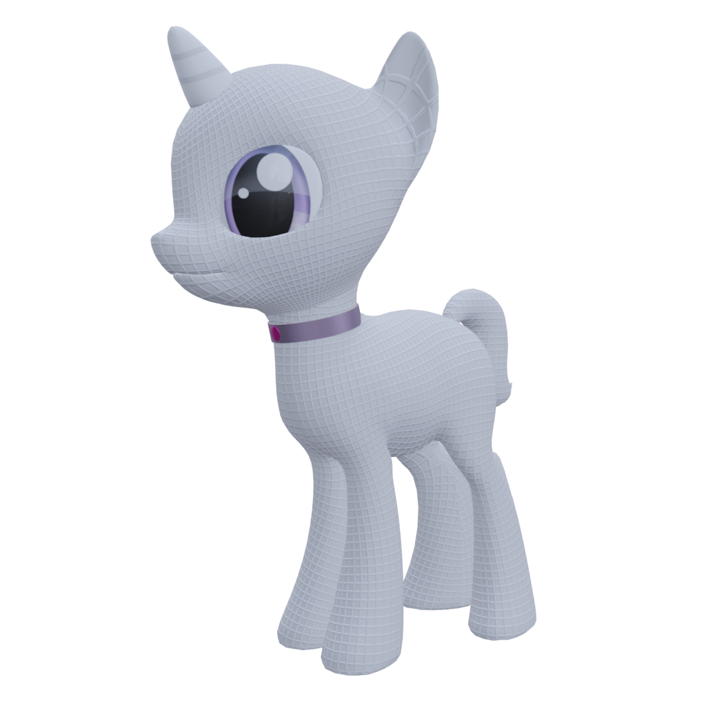
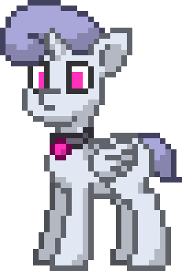
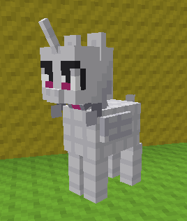

1. 
{:toc}

the characters that i've made, for various degrees of "made"
generally all of these are canonically he/they/etc like me (except the pony which is more it/its), *but* feel free to use other pronouns too (since i'm not super connected to them and also don't mind pronouns in general)
you-the-reader hereby have my permission to draw/remix/steal/etc any of these if you so desire, as per [cc0](https://creativecommons.org/publicdomain/zero/1.0/) (though note that other people's art featured here isn't under that)
kinda funny since a fursona is supposed to represent me yet i keep making characters that i'd want to hug and one can't really hug oneself properly can one (though i suppose [the creature](#creature) can wrap itself up in its tail)

general traits:
- either braver than me or exaggeratedly shy and self-deprecating
- extremely cuddly, will hug the heck out of you if you let them
- voice could be similar to [the ring from ring fit adventure](https://www.youtube.com/watch?v=2ySV2xtEIGA) and/or [timber puppers' ralsei](https://www.youtube.com/watch?v=MZiyMuvfi-E)
- usually idealized bodies, as in no biological trappings like sweating or having to eat or even sleep

# hecko
2018-11-28

**[gallery!](hecko/)**

my main character, [tails the fox](https://en.wikipedia.org/wiki/Tails_(character)) but pure white and one small tail, sometimes with a glowing blue eye a la [sans](https://undertale.fandom.com/wiki/Sans), sometimes with [Ralsei](https://deltarune.fandom.com/wiki/Ralsei)'s clothing
in some iterations he can "clone" himself (have multiple bodies) and/or turn into a four-legged fox

started out like so:
1. a long time ago i used to use images of tails as profile pictures
2. i wanted to have a funny sans version of tails for my discord avatar and i stumbled upon a cursed mess that i'm not sure if i still have
3. i added Ralsei features to it (2018-11-28)
	
4. angel drew it for some reason (2019-09-15)
	{: style="width: 50%" }
5. i drew/generated a [set of deltarune-style talksprites](https://github.com/Sobsz/heckosprites) for it for [Ralsei·bot](https://ralsei.chlod.net/)-assisted roleplay (2019-11-30)
	
6. now it's my fursona i guess

also has a pony version

# wesley
2018-12-26

anthro bear with gold fur, 2/3rds human height apparently? i don't remember writing that, i usually imagine him as regular height
can summon illusions with varying degrees of solidity
mute, uses the above to summon subtitles
see [here](https://gist.github.com/Sobsz/38dc8aa415f53697ab04d4e9d2ffa0dd) for more details (though i wrote it when i was younger and more foolish so it has some amount of yikes)

not used a whole lot unfortunately

{: style="width: 50%" }

# ignios
2019-08-11

deltarune boss monster oc with gold fur and a sun motif on his chest
sorta similar to [wesley](#wesley) but as a gote and with different powers
and uhhh how about i just write from the ref sheet below
- ignios (but you can call him iggy)
- gender: male
- age: bab
- height: like 4 feet idk
- alignment: chaotic cute
- wields the magical powers of the SUN™
	- but since he's a bab they mostly amount to being very warm and making himself glow
- clothing: no thanks
- likes:
	- tacos
	- hugs
	- roleplaying
	- nice cream guy
	- you!

exactly one fanart by discord user Lazy#6665:

# geck
2020-02-07/09

green anthro gecko with 4 arms and (barely visible in the picture) acid-green pawpads on the hands, also horns for some reason
mostly just an attempt to sculpt something in blender
[download .blend file here](geck/geck.blend) if you wish (contains non-functional rig)

# pony
2021-05-28

codename `helping hoof` yes it's cringy but i couldn't think of a better one

white synthetic [pony](https://en.wikipedia.org/wiki/My_Little_Pony:_Friendship_is_Magic) made of a marshmallow-like material with a grid outdent, a bit smaller than usual, wearing a collar
has both wings and horn because why not
a possible lore is that it was a robot-esque thing (hence more it/its) made to serve and that the collar keeps it obedient, and/or when you tap the collar gem it flashes and listens for commands like a virtual assistant; another possible lore was that it says the collar does so but really it just likes to do stuff for people

i have a 3d mockup but it was before i added hair so try to imagine a combination of the upcoming 2 pictures

here's another hairless pic of it in [classicube](https://classicube.net/)

## other ponies

bashful byte (bad), 2022-07-10

emerald snap (good), 2022-08-13

# creature
ideation started 2022-10-11, most recent update 2023-02-10

made of synthetic marshmallow again (no bones or anything), though i'll allow a bit of fuzz (makes more sense on the dark bits but the neon ones are allowed too)
only somewhat modeled after real specieses, e.g. the hooves are explicitly not realistic because i dislike that bump they have in e.g. mlp
the model turned out 7'3" (220 cm) in internal units and tbh that sounds about right

the sparkly neon regions (fully variable rgb btw) are supposed to be translucent regions of the body showing the creature's insides (100% neon goop)
tail can be rolled and unrolled to any size (to infinity and beyond) through toon logic; ears don't have that but could probably be rolled into spirals for convenience (like hair rolls)

it does canonically have a mouth i just don't know how to model it properly
the hands are placeholders, ideally they'd be big 5-fingered pawbs with stick-out beans

unsure about head shape, particularly snout size
might remove the neck fluff, i wanted it large enough to function as [hammerspace](https://en.wikipedia.org/wiki/Hammerspace) but i can't figure out how to do that well
kinda considered inverting tail pattern (`texture alt` in the .blend file matches that), pros: dim fuzzy inside to curl up in, cons: inconsistent with inside of ears being neon, looks bad; stripes on the sides would fit though so maybe

[have a .blend file](creature/another fursona test.blend) (3.4, messy, unrigged)

**note**: the images below are out of date, namely the ears are now half the size of that pictured

