1. 
{:toc}

the characters that i've made, for various degrees of "made"
generally all of these are canonically he/they/etc like me (except [helping hoof](#helping-hoof) which is more it/its), *but* feel free to use other pronouns too (since i'm not super connected to them and also don't mind pronouns in general)
you-the-reader hereby have my permission to draw/remix/steal/etc any of these if you so desire, as per [cc0](https://creativecommons.org/publicdomain/zero/1.0/) (though note that other people's art featured here isn't under that)
kinda funny since a fursona is supposed to represent me yet i keep making characters that i'd want to hug and one can't really hug oneself properly can one (though i suppose [the fox](#hecko) has clones and [the creature](#creature) can wrap itself up in its tail)

current favorite is probably [emerald snap](#emerald-snap)

general traits:
- either braver than me or exaggeratedly shy and self-deprecating
- extremely cuddly, will hug the heck out of you for eons if you let them
- voice could be similar to [timber puppers's ralsei](https://www.youtube.com/watch?v=MZiyMuvfi-E) and [tyler scowcroft's ring from ring fit adventure](https://www.youtube.com/watch?v=2ySV2xtEIGA), or perhaps [wynton yang's ralsei](https://www.youtube.com/watch?v=6Vfc61BjhUQ) and [sibylline sounds' bookshop skunk](https://www.youtube.com/watch?v=osJmMstb7_E) [fetish cw for their other videos]
- usually idealized bodies, as in no biological trappings like sweating or having to eat or even sleep
- 5-fingered hands (if any) with opposable thumbs, though i may change my mind because that's not a lot of room for thick beans and cat paws are cute

# ghost fox
2018-08-12

not really a fursona but it is the first animal sorta-character i remember making
made for a shitposty collaborative comic thing, where the first action by someone other than me was to kill my character (hence ghost)

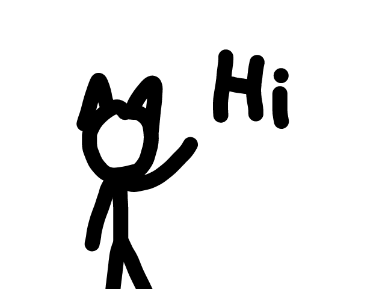
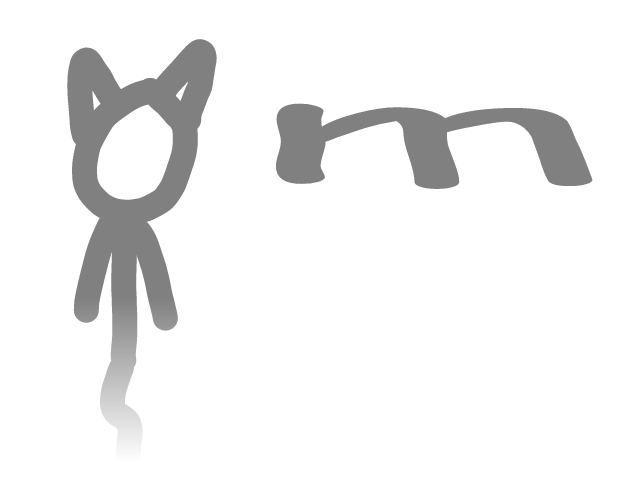

# hecko
2018-11-28

**[gallery!](hecko/)**

my main character, scruffy pure-white snoutless fox (tail size undefined)
originally with [ralsei](https://deltarune.fandom.com/wiki/Ralsei)'s clothing and [sans](https://undertale.fandom.com/wiki/Sans)'s glowing blue eye but nowadays not really
in some iterations he can "clone" himself (have multiple bodies) and/or turn into a four-legged fox

started out like so:
1. a long time ago i used to use images of [tails the fox](https://en.wikipedia.org/wiki/Tails_(character)) as profile pictures
2. i wanted to have a funny sans version of him for my discord avatar and i stumbled upon a cursed mess that i'm not sure if i still have
3. i added ralsei features to it (2018-11-28)
	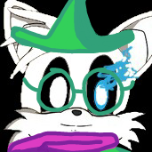{:.copyrighted}
4. electriclizardfren drew it for some reason (2019-09-15)
	{:.copyrighted style="width: 400px; max-width: 100%;"}
5. i drew/generated a [set of deltarune-style talksprites](https://github.com/Sobsz/heckosprites) for it for [Ralsei·bot](https://ralsei.chlod.net/)-assisted roleplay (2019-11-30)
	
6. now it's my fursona i guess

also has a pony version

{:.copyrighted}

# wesley
2018-12-26

anthro bear with gold fur, 2/3rds human height apparently? i don't remember writing that, i usually imagine him as regular height
can summon illusions with varying degrees of solidity
mute, uses the above to summon subtitles
see [here](https://gist.github.com/Sobsz/38dc8aa415f53697ab04d4e9d2ffa0dd) for more details (though i wrote it when i was younger and more foolish so it has some amount of yikes)

not used a whole lot unfortunately

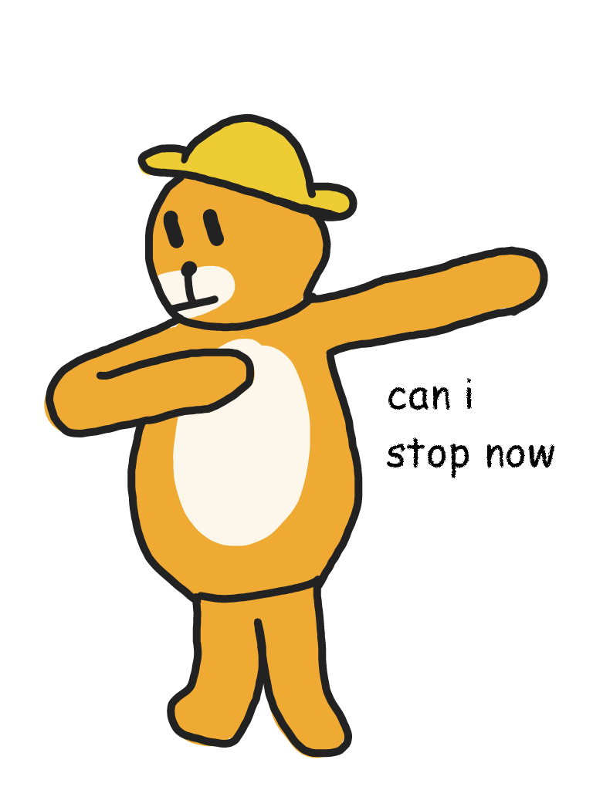
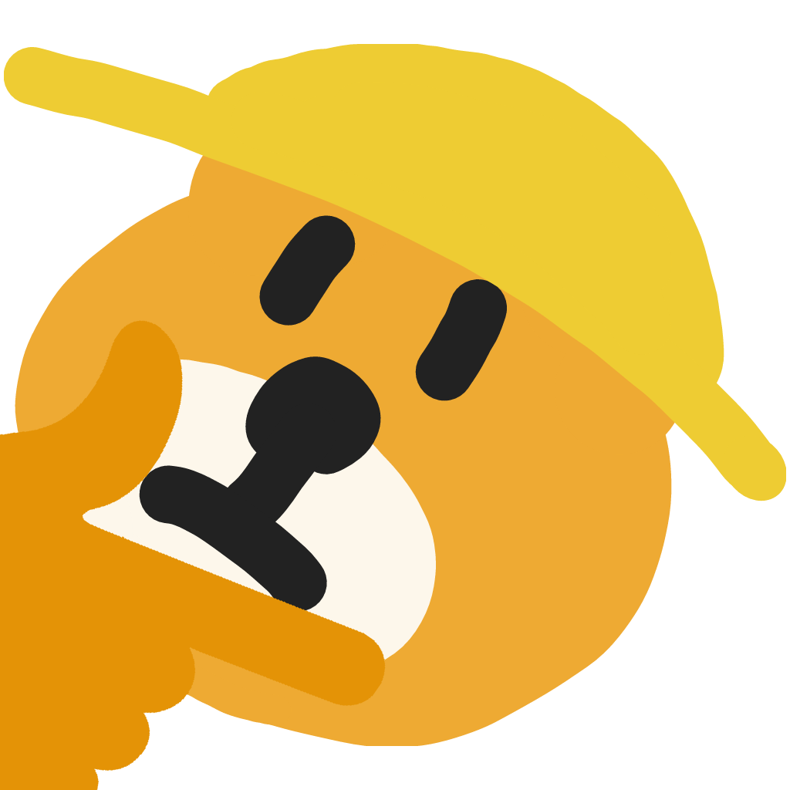{:style="max-width: 400px;"}

# ignios
2019-08-11

deltarune boss monster oc with gold fur and a sun motif on his chest
sorta similar to [wesley](#wesley) but as a gote and with different powers
and uhhh how about i just write from the ref sheet below
- ignios (but you can call him iggy)
- gender: male
- age: bab
- height: like 4 feet idk
- alignment: chaotic cute
- wields the magical powers of the SUN™
	- but since he's a bab they mostly amount to being very warm and making himself glow
- clothing: no thanks
- likes:
	- tacos
	- hugs
	- roleplaying
	- nice cream guy
	- you!

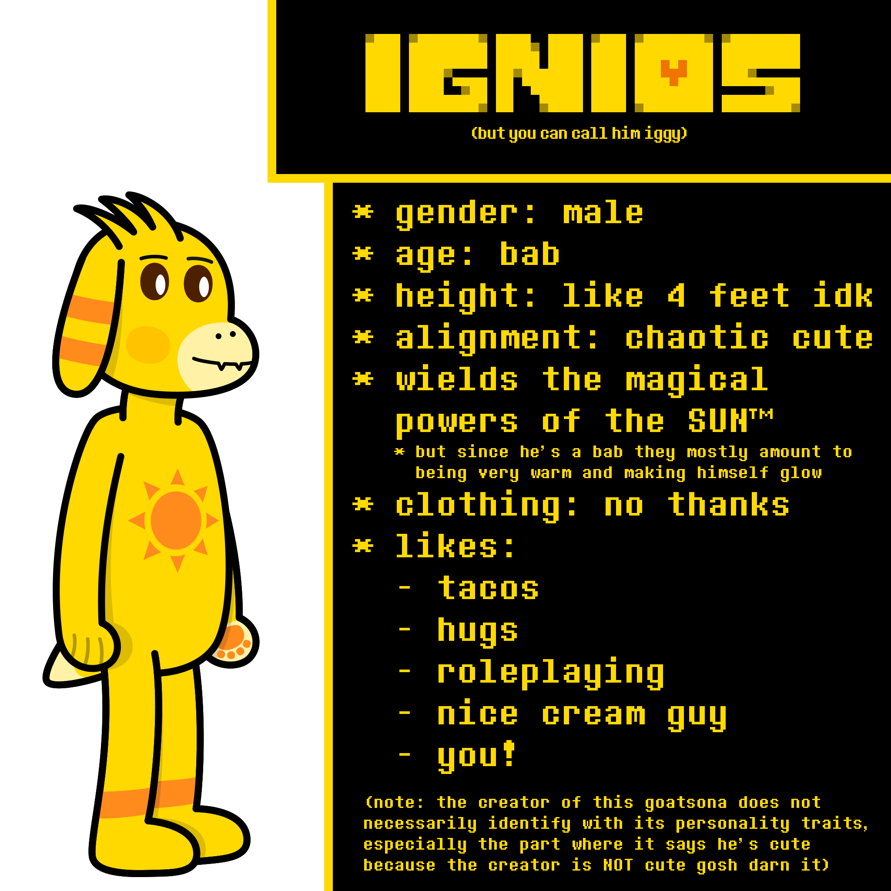

exactly one fanart by discord user Lazy#6665:
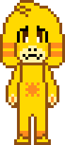{:.copyrighted}

# geck
2020-02-07/09

green anthro gecko with 4 arms and (barely visible in the picture) acid-green pawpads on the hands, also horns for some reason
mostly just an attempt to sculpt something in blender
[download .blend file here](geck/geck.blend) if you wish (contains non-functional rig)

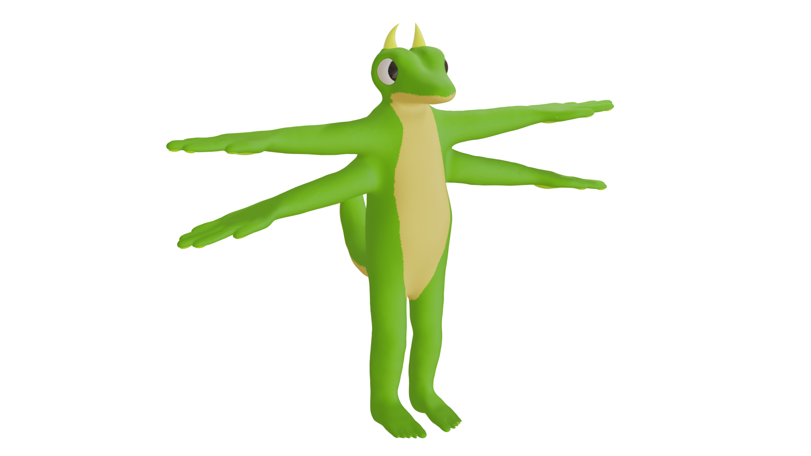

# ponies

of specifically the [mlp](https://en.wikipedia.org/wiki/My_Little_Pony:_Friendship_is_Magic) variety

## helping hoof
2021-05-28

yes the name is cringy but i couldn't think of a better one, i don't use that name often anyway

white synthetic honse made of a marshmallow-like material with a grid outdent, a bit smaller than usual, wearing a collar
has both wings and horn because why not
a possible lore is that it was a robot-esque thing (hence more it/its) made to serve and that the collar keeps it obedient, and/or when you tap the collar gem it flashes and listens for commands like a virtual assistant; another possible lore was that it says the collar does so but really it just likes to do stuff for people

i have a 3d mockup but it was before i added hair so try to imagine a combination of the upcoming 2 pictures

{:.copyrighted}
{:.copyrighted}

here's another hairless pic of it in [classicube](https://classicube.net/)

## bashful byte
2022-07-10

i don't like it

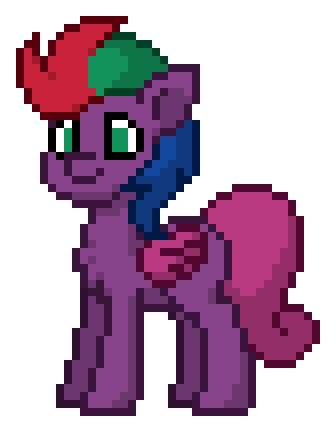{:.copyrighted}

## emerald snap
2022-08-13

i do like it

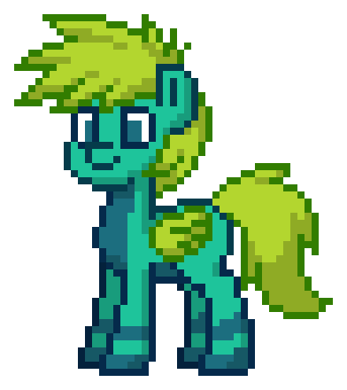{:.copyrighted}

also has a pic made for funkin' is magic using [this base by bbpanzu](https://twitter.com/bbpnz213/status/1670682977230114816) but it's rushed and not very good
{:.copyrighted}

# plushies

made for a now-inactive [deltarune](https://en.wikipedia.org/Deltarune) roleplay, part of an implied set of dozens (of common species that aren't already represented in deltarune)

## topaz
2022-07-18

magic geek, has turned into a sort of phoenix once

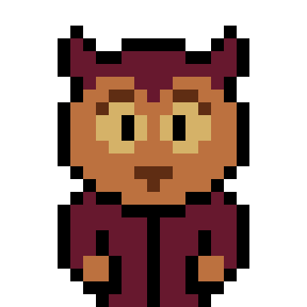

## saffron
2022-11-04 - 2022-11-10

started out normal, became smug in an effort to outsmug the main villain, immediately regretted it and became snowdrop instead to have people not hate him

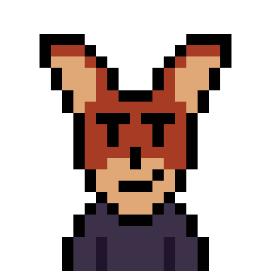
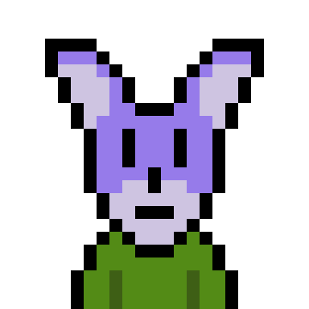

# otter
2022-08-22

mostly made by electriclizardfren, included for completeness
not pictured: unlimited stretchability (with constant width, in toony defiance of conservation of mass)

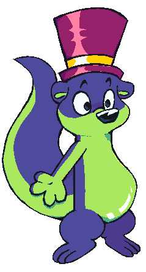{:.copyrighted}

# creature
ideation started 2022-10-11, most recent update 2023-02-22

made of synthetic marshmallow again (no bones or anything), though i'll allow a bit of fuzz (makes more sense on the dark bits but the neon ones are allowed too)
only somewhat modeled after real specieses, e.g. the hooves are explicitly not realistic because i dislike that bump they have in e.g. mlp
the model turned out 7'3" (220 cm) in internal units and tbh that sounds about right

the sparkly neon regions (fully variable rgb btw) are supposed to be translucent regions of the body showing the creature's insides (100% neon goop)
tail can be rolled and unrolled to any size (to infinity and beyond) through toon logic; ears don't have that but could probably be rolled into spirals for convenience (like hair rolls)

it does canonically have a mouth i just don't know how to model it properly
the hands are placeholders, ideally they'd be big 5-fingered pawbs with stick-out beans
ideally the tail spiral wouldn't end in a hole but i couldn't figure out how to model that with my method

unsure about head shape, particularly snout size
might remove the neck fluff, i wanted it large enough to function as [hammerspace](https://en.wikipedia.org/wiki/Hammerspace) but i can't figure out how to do that well
idk if i want the stripes everywhere, maybe just regular [countershading](https://en.wikipedia.org/wiki/Countershading)? **[see last image]**
kinda considered inverting tail pattern (`texture alt` in the .blend file matches that), pros: dim fuzzy inside to curl up in, cons: inconsistent with inside of ears being neon, looks bad; stripes on the sides would fit though so maybe
legs might be better off just being [rubberhose](https://en.wikipedia.org/wiki/Rubber_hose_animation) instead of my attempt at a semi-realistic shape (would help make it possible for the soles of the hooves to touch each other which for some reason appeals to me)

[have a .blend file](creature/another fursona test.blend) (3.4, messy, unrigged)

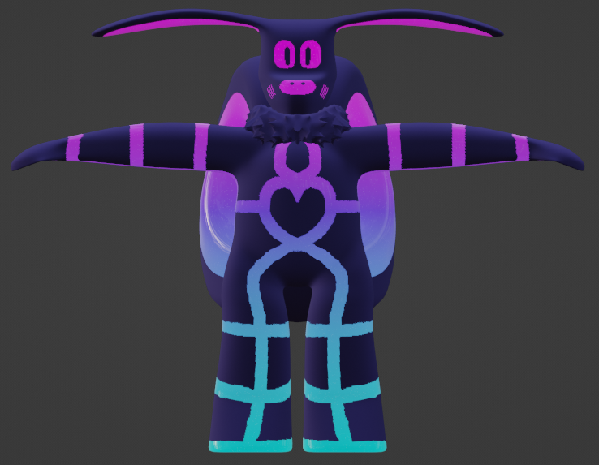
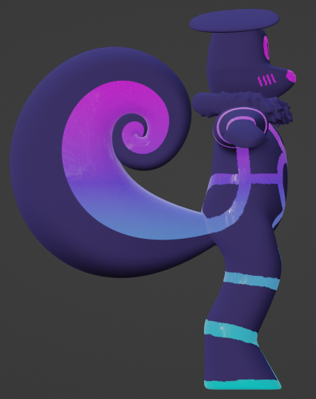
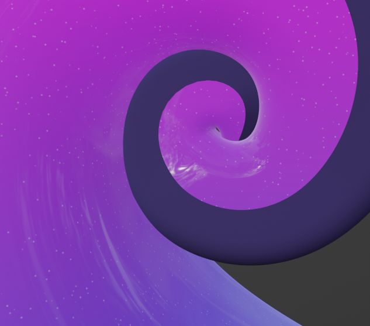
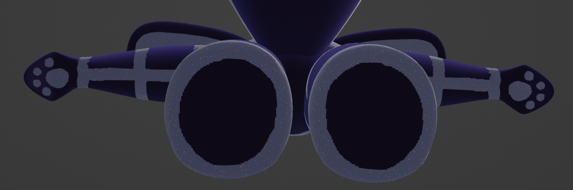

# deer
2023-02-22 (at like 3am)

probably my first non-cuddlemaxxed character

pink body, very·hot-pink beans and hooves, light-yellow [countershading](https://en.wikipedia.org/wiki/Countershading) and inside of ears (and ear fluff probably), yellow eyes and neck fluff
plush maybe? not necessarily for cuddle purposes, i just feel it'd be neat (though idk if useful hands would fit it well)
i usually do plain colors but maybe this time i could/should do some sort of spots? freckles at least?
probably both anthro and feral forms; anthro probably gets paws (maybe cat paws so it can be a [bappy](https://www.urbandictionary.com/define.php?term=Bappers) mew [deer](https://en.wiktionary.org/wiki/happy_New_Year#English))
male-ish but no antlers ~~because [noelle deltarune](https://deltarune.fandom.com/wiki/Noelle) stole them~~ (actually because i feel they'd get in the way, also i have been informed female reindeer have antlers too)
glasses? collar? skirt? ~~thigh-highs?~~ (nah because they'd cover up the hoofsies)

no proper canonical picture yet but have [a wip blender model](deer/deersona.blend) (main deviations: no ear fluff, no spots, fingers are thinner than i'd like them to be, beans are weird):

and a [base](https://www.furaffinity.net/view/42146255/) by [mizusky](https://www.furaffinity.net/user/mizusky/):

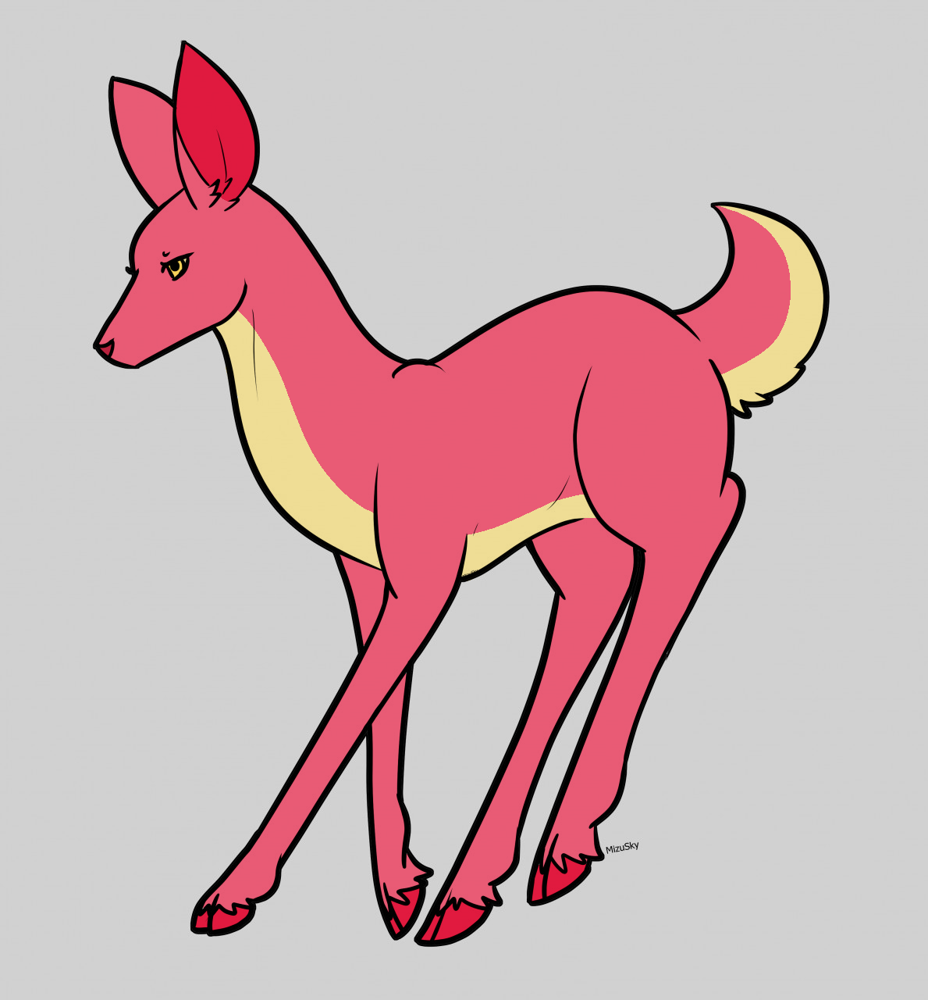{:.copyrighted}

and a [picrew](https://picrew.me/image_maker/104106) by [oatmeaio](https://linktr.ee/oatmeaio) (hooves instead of paws because pretty):

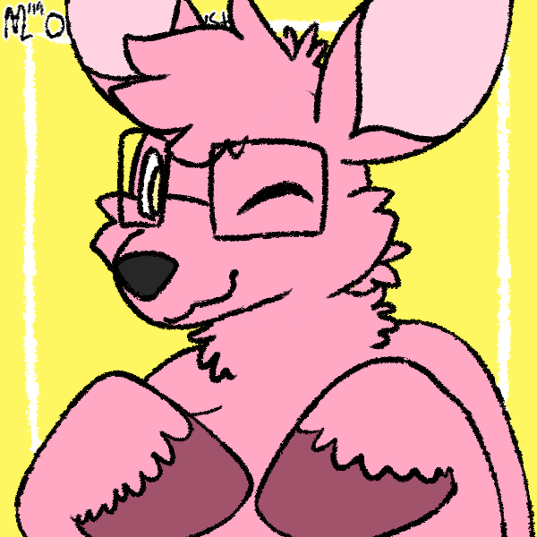{:.copyrighted}

and [another](https://picrew.me/en/image_maker/1742063) by [treez0n](https://instagram.com/treez0n/):

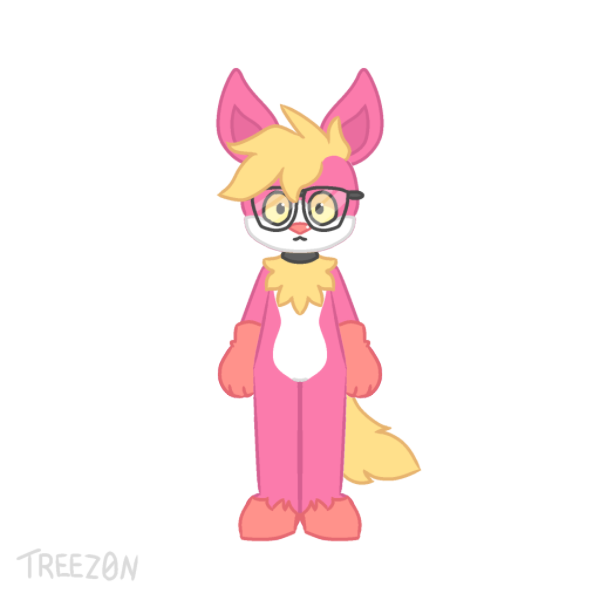{:.copyrighted}